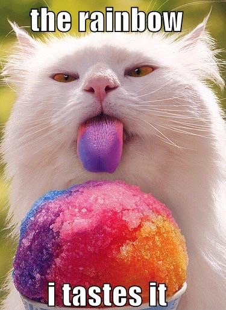
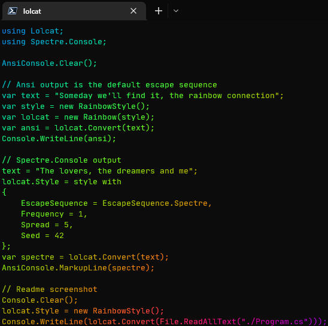
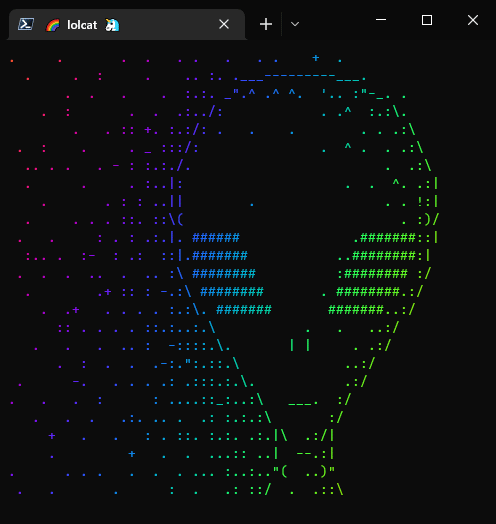

## 🌈 lolcat 🦄

[](https://github.com/si618/lolcat/actions/workflows/workflow.yml)
[](https://www.nuget.org/packages/lolcat)
[](https://www.nuget.org/stats/packages/lolcat?groupby=ClientName)
[](LICENSE)

[lolcat](https://github.com/busyloop/lolcat) dotnet library ported from [powershell module](https://github.com/andot/lolcat) 🙇‍

## 🧐 What?



## 📸 Screenshots





## 🚧 Installation

```bash
> dotnet add package lolcat
```

## 🏗 Build️

```bash
> dotnet --list-sdks
6.0.402 [/usr/share/dotnet/sdk]

> git --version
git version 2.37.3

> git clone https://github.com/si618/lolcat.git
Cloning into 'lolcat'...

> cd lolcat
> dotnet build
```

## 🧪 Test

```bash
> dotnet test
```

## ⚗ Benchmark

[Github charts](https://si618.github.io/lolcat/dev/bench)

```bash
> cd ./tests/Lolcat.Benchmarks
> dotnet run -c release
```

## 🎉 Demo

[Static](src/Lolcat.Demo/Program.cs) or [animated]([Code](src/Lolcat.Demo.Animated/Program.cs)
)

```bash
> cd ./src/Lolcat.Demo
> dotnet run
> cd ../Lolcat.Demo.Animated
> dotnet run
```
