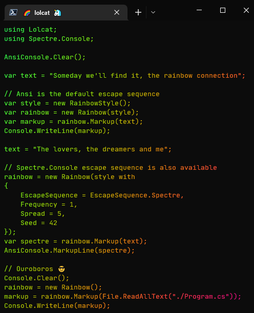

## lolcat ✨

[](https://github.com/si618/lolcat/actions/workflows/workflow.yml)
[](https://www.nuget.org/packages/lolcat/)
[](LICENSE)

.NET implementation of [lolcat](https://github.com/busyloop/lolcat)

## What? 🧐


## Screenshot 📸



## Kudos 🍻

Ported with thanks from the [PowerShell module](https://github.com/andot/lolcat) implementation

## Installation 🚧

```bash
> dotnet add package lolcat
```

## Demo 🎉

[Code](src/Lolcat.Demo/Program.cs)

```bash
> cd ./src/Lolcat.Demo
> dotnet run
```

## Build 🏗️

```bash
> dotnet --list-sdks
6.0.402 [/usr/share/dotnet/sdk]

> git --version
git version 2.37.3

> git clone https://github.com/si618/lolcat.git
Cloning into 'lolcat'...

> cd lolcat
> dotnet build
```

## Test 🧪

```bash
> dotnet test
```

## Benchmark ⚗️

```bash
> cd ./tests/Lolcat.Benchmarks
> dotnet run -c release
```